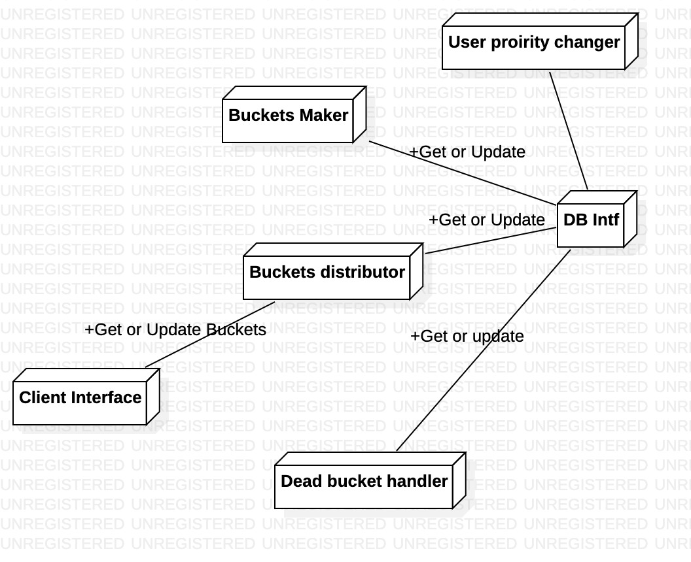
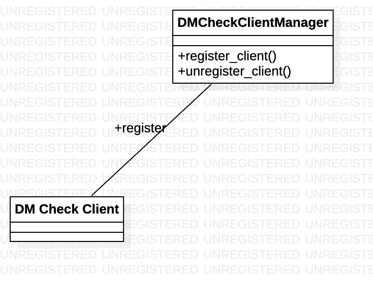
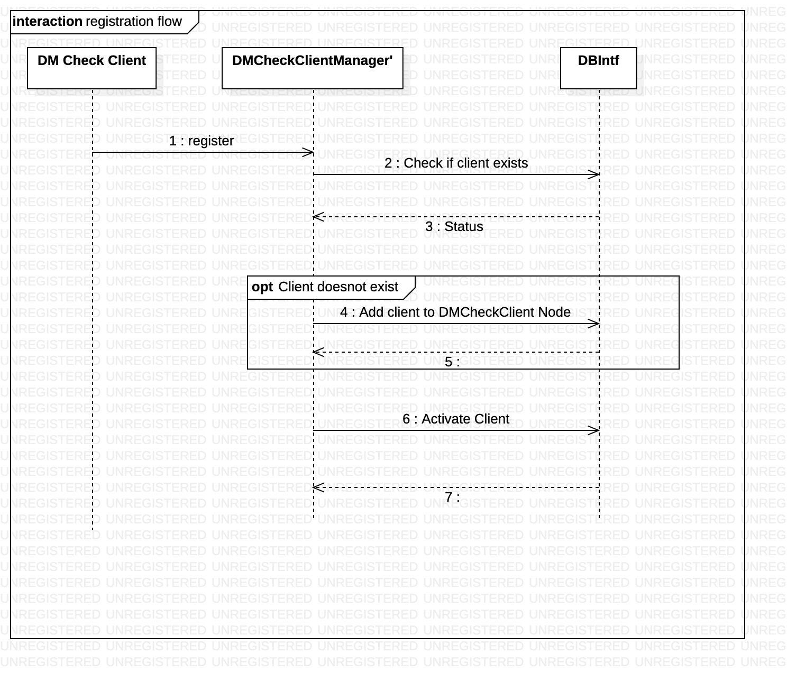

<!-- vscode-markdown-toc -->
* 1. [Vision](#Vision)
* 2. [Requirements break-down](#Requirementsbreak-down)
	* 2.1. [Functional requirements](#Functionalrequirements)
	* 2.2. [Non-functional requirements](#Non-functionalrequirements)
* 3. [Architecture](#Architecture)
	* 3.1. [Architecture diagram](#Architecturediagram)
* 4. [Use cases walkthrough](#Usecaseswalkthrough)
	* 4.1. [Below use-case talks about how the users are divided in buckets.](#Belowuse-casetalksabouthowtheusersaredividedinbuckets.)
	* 4.2. [Below use-case talks how multiple clients takes items and update. Also, it talks about challenges](#Belowuse-casetalkshowmultipleclientstakesitemsandupdate.Alsoittalksaboutchallenges)
	* 4.3. [Below use-case talks about error conditions which can happen in this system](#Belowuse-casetalksabouterrorconditionswhichcanhappeninthissystem)
	* 4.4. [Below use-case captures various software exceptions](#Belowuse-casecapturesvarioussoftwareexceptions)
* 5. [Important scenrios](#Importantscenrios)
	* 5.1. [User wants to process a user with higher priority and user is already picked for processing with lower priority](#Userwantstoprocessauserwithhigherpriorityanduserisalreadypickedforprocessingwithlowerpriority)
		* 5.1.1. [Approch-1](#Approch-1)
		* 5.1.2. [Approach-2](#Approach-2)
	* 5.2. [Case where system unlocks dead bucket when client is updating at the same time](#Casewheresystemunlocksdeadbucketwhenclientisupdatingatthesametime)
		* 5.2.1. [Approch-1](#Approch-1-1)
		* 5.2.2. [Approach-2](#Approach-2-1)
* 6. [Component design](#Componentdesign)
	* 6.1. [Client Manager component](#ClientManagercomponent)
		* 6.1.1. [Class Diagram](#ClassDiagram)
		* 6.1.2. [Sequence diagram](#Sequencediagram)

<!-- vscode-markdown-toc-config
	numbering=true
	autoSave=true
	/vscode-markdown-toc-config -->
<!-- /vscode-markdown-toc -->
# DM check subsystem

##  1. Vision
Multiple clients like to contribute in checking openDM. These clients can come and go anytime. System should provide fault tolerant and efficient solution for them to contribute.

##  2. Requirements break-down
###  2.1. Functional requirements
* Multiple clients should be able to fetch user list for checking
* Only the client who got the user list should be able to update
* Only registered client should be able to interact with system
* Client can be able to specify its capability and system should be able to provide number of user lists accordingly
* In case of any difficulty(Crash for example), Client should be able to recollect its owned user list with the help of system
* User should be able to give list of users which needs high priority for processing OpenDM
* User should be able to view list of users which are not yet marked for processing.
* If user is deleted, then system should silently discard any update of OpenDM for this user
* On user deletion, system should delete corresponding OpenDM info as well
* Multiple clients should be able to proxy using same Tweeter ID. However, in this case, its  the client responsibility to maintain harmony among themselves. System will treat all such clients as identical

###  2.2. Non-functional requirements
* Clients should not wait for getting user list
* Client should not wait while updaing openDM info for user list assigned to it
* System should be fair to users for OpenDM check. It means that no user openDM check should be starved for ever
* System should unlock user lists owned by dead clients and reassigns
* System should have minimal load on DB while its processing. This data should be instrumented and published.
* System should have a resonable maximum wait time for processing any user openDM once it marked for processing. For non-marked, user, its fine as user can assing if needed. 
* System should be able to scale with reasonable limit. Limit should be advertised
* System should avoid giving same user list to multiple clients. However, for performance, it may be accepted, but should not be a practice.
* System should be lock-free. Lock must be used only when it can't be avoided. Its requirement for scale. Lock will be bottleneck for any system with lock
* Any client should not be able to predict its assigned user list or manipulate system to get user list of its choice. This requirement is related to privacy and security

##  3. Architecture
This problem can be mapped to public distribution system(PDS). Note that PDS shops gives the fix amount of groceriers to multiple card holders. Card holder can be anyone who has government approval. Generally on distribution day, there will be queue. To speedize, this shop owner makes bucket of rations as pre-processing. This helps shop owner to distribute ration in parallel.

###  3.1. Architecture diagram
Below diagram depicts various building blocks of this system

##  4. Use cases walkthrough
###  4.1. Below use-case talks about how the users are divided in buckets.

###  4.2. Below use-case talks how multiple clients takes items and update. Also, it talks about challenges

###  4.3. Below use-case talks about error conditions which can happen in this system

###  4.4. Below use-case captures various software exceptions

##  5. Important scenrios
###  5.1. User wants to process a user with higher priority and user is already picked for processing with lower priority

* A background process keeps on making buckets of users for OpenDM check
* User wants a set of users to be processed at higher priority
    * This user will immediately be put as bucket
    * If user is already in a bucket with lower priority, then it results in multiple processing

####  5.1.1. Approch-1
    * One approach is to add in new bucket with higher priority 
        *  Keep it in lower priority bucket as well to make the simple design and implementation
        *  Delete from Lower priority bucket , but then take care of case when bucket is already picked for processing
####  5.1.2. Approach-2
    * Another approach is to process buckets fast enough so that there is no need of adding user in another bucket. In this case,number of buckets must be short enough so that a bucket pool can’t take more than multiple hours.

###  5.2. Case where system unlocks dead bucket when client is updating at the same time
Below condition results in race condition
* System detects a dead bucket (bucket whose client is dead)
* System unlocks the bucket and allocates the bucket to new client
* At the same time, old client tries to update openDM info for  the bucket. System is unaware of this.

####  5.2.1. Approch-1
As an approach, we can allow client to update and then delete the bucket. If another processor picks, then it will be extra processing. But It will update the info. 
####  5.2.2. Approach-2
To avoid this condition at all, we can first mark the bucket as dead and after sometime we can unlock, This way, race condition will not happen

##  6. Component design
###  6.1. Client Manager component
####  6.1.1. Class Diagram

####  6.1.2. Sequence diagram
