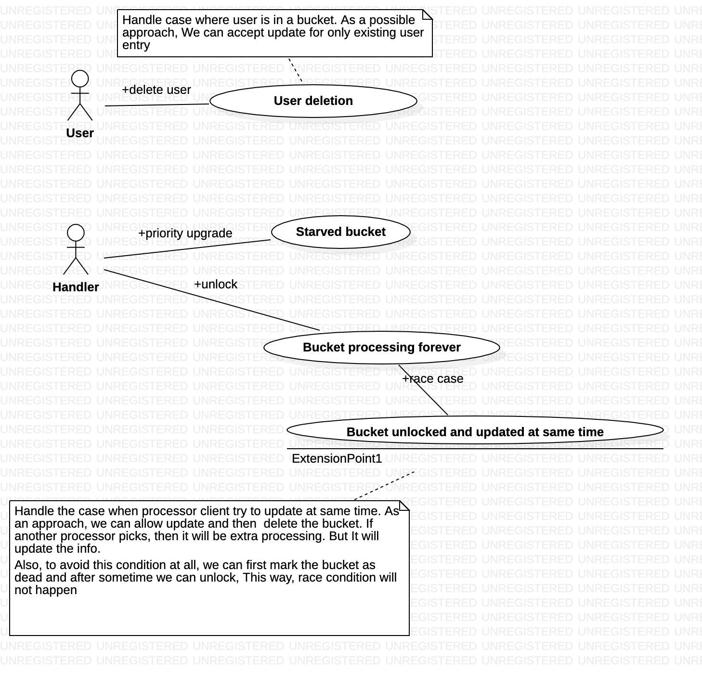

# DM check subsystem

## Vision
Multiple clients like to contribute in checking openDM. These clients can come and go anytime. System should provide fault tolerant and fast soltion for them to contribute.

## Architecture
This problem can be mapped to public distribution system(PDS). Note that PDS shops gives the fix amount of groceriers to multiple card holders. Card holder can be anyone who has government approval. Generally on distribution day, there will be queue. To speedize, this shop owner makes bucket of rations as pre-processing. This helps shop owner to distribute ration in parallel.

## Use cases walkthrough
### Below use-case talks about how the users are divided in buckets.

### Below use-case talks how multiple clients takes items and update. Also, it talks about challenges

### Below use-case talks about error conditions which can happen in this system

### Below use-case captures various software exceptions

