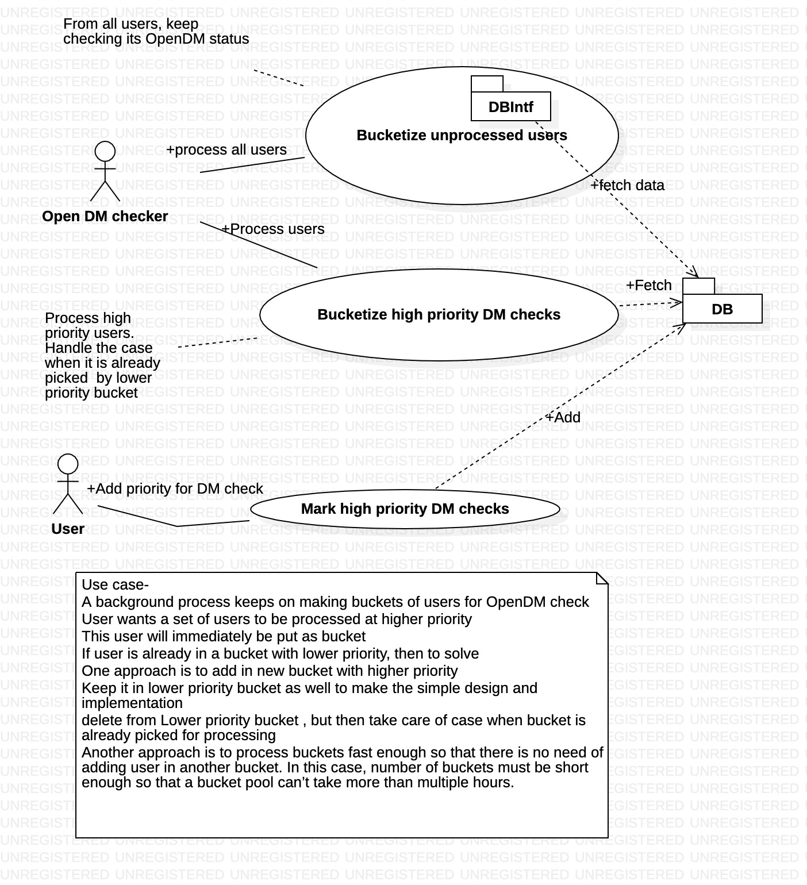
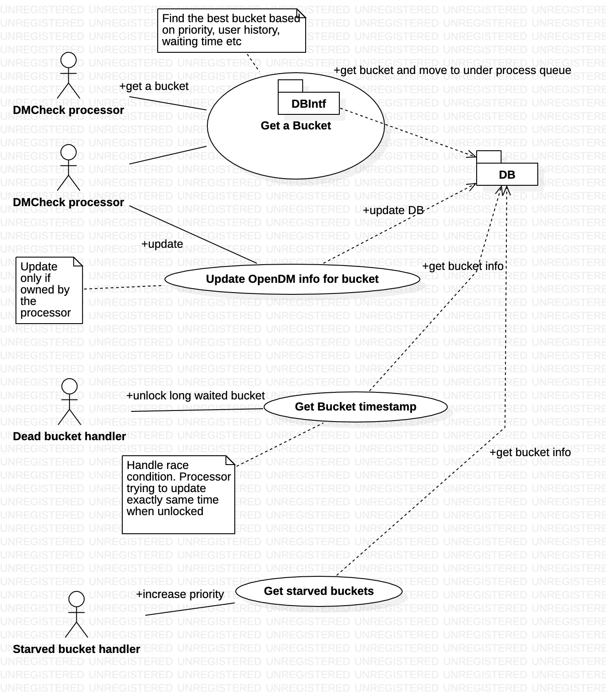
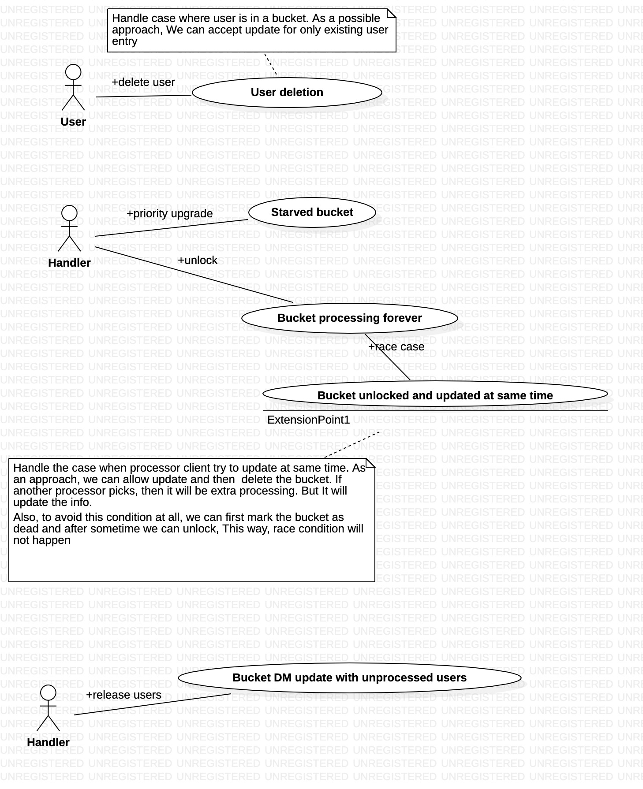
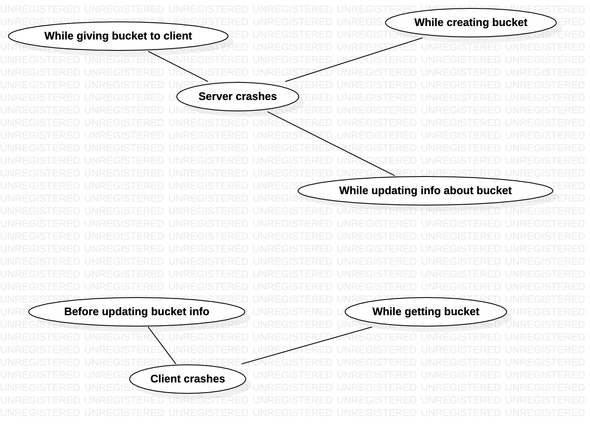

<!-- vscode-markdown-toc -->
* 1. [Vision](#Vision)
* 2. [Requirements break-down](#Requirementsbreak-down)
	* 2.1. [Functional requirements](#Functionalrequirements)
	* 2.2. [Non-functional requirements](#Non-functionalrequirements)
* 3. [Architecture](#Architecture)
* 4. [Use cases walkthrough](#Usecaseswalkthrough)
	* 4.1. [Below use-case talks about how the users are divided in buckets.](#Belowuse-casetalksabouthowtheusersaredividedinbuckets.)
	* 4.2. [Below use-case talks how multiple clients takes items and update. Also, it talks about challenges](#Belowuse-casetalkshowmultipleclientstakesitemsandupdate.Alsoittalksaboutchallenges)
	* 4.3. [Below use-case talks about error conditions which can happen in this system](#Belowuse-casetalksabouterrorconditionswhichcanhappeninthissystem)
	* 4.4. [Below use-case captures various software exceptions](#Belowuse-casecapturesvarioussoftwareexceptions)

<!-- vscode-markdown-toc-config
	numbering=true
	autoSave=true
	/vscode-markdown-toc-config -->
<!-- /vscode-markdown-toc -->
# DM check subsystem

##  1. Vision
Multiple clients like to contribute in checking openDM. These clients can come and go anytime. System should provide fault tolerant and fast soltion for them to contribute.

##  2. Requirements break-down
###  2.1. Functional requirements
* Multiple clients should be able to fetch user list for checking
* Only the client who got the user list should be able to update
* Only registered client should be able to interact with system
* Client can be able to specify its capability and system should be able to provide number of user lists accordingly
* In case of any difficulyt(Crash for example), Client should be able to recollect its owned user list with the help of system
* User should be able to give list of users which needs high priority for processing OpenDM
* User should be able to view list of users which are not yet marked for processing.
* If user is deleted, then system should silently discard any update of OpenDM for this user
* On user deletion, system should delete corresponding OpenDM info as well

###  2.2. Non-functional requirements
* Clients should not wait for getting user list
* Client should not wait while updaing openDM info for user
* System should be fair to users for OpenDM check. It means that no user openDM check should be starved for ever
* System should unlock user lists owned by dead clients and reassigns
* System should have minimal load on DB while its processing
* System should have a resonable maximum wait time for processing any user openDM once it marked for processing. For non-marked, user, its fine as user can assing if needed.
* System should be able to scale with reasonable limit. Limit should be advertised
* System should avoid giving same user list to multiple clients. However, for performance, it may be accepted, but should not be a practice.

##  3. Architecture
This problem can be mapped to public distribution system(PDS). Note that PDS shops gives the fix amount of groceriers to multiple card holders. Card holder can be anyone who has government approval. Generally on distribution day, there will be queue. To speedize, this shop owner makes bucket of rations as pre-processing. This helps shop owner to distribute ration in parallel.

##  4. Use cases walkthrough
###  4.1. Below use-case talks about how the users are divided in buckets.

###  4.2. Below use-case talks how multiple clients takes items and update. Also, it talks about challenges

###  4.3. Below use-case talks about error conditions which can happen in this system

###  4.4. Below use-case captures various software exceptions

