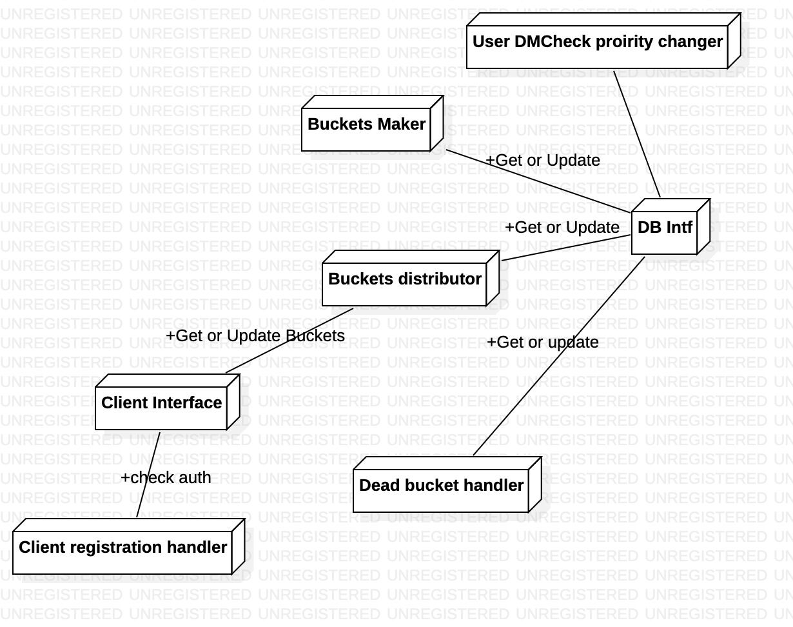
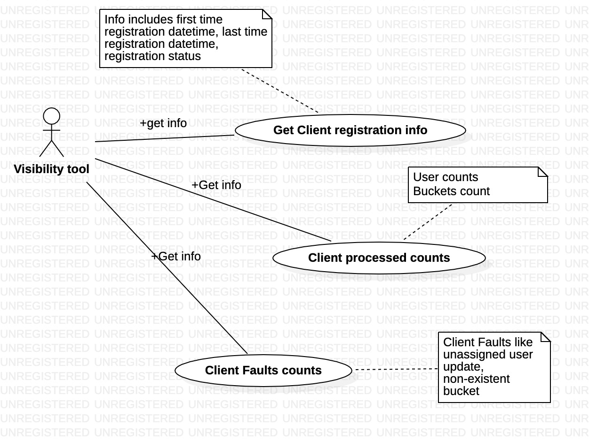
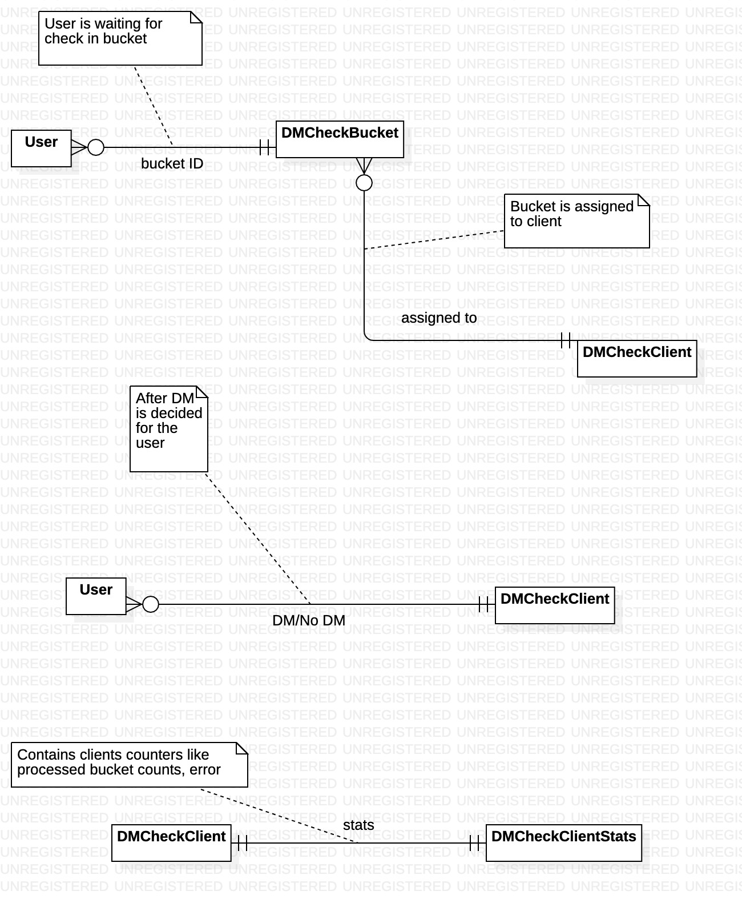

<!-- vscode-markdown-toc -->
* 1. [Vision](#Vision)
* 2. [Requirements break-down](#Requirementsbreak-down)
	* 2.1. [Functional requirements](#Functionalrequirements)
	* 2.2. [Non-functional requirements](#Non-functionalrequirements)
* 3. [Architecture](#Architecture)
	* 3.1. [Architecture diagram](#Architecturediagram)
	* 3.2. [Architecture principles](#Architectureprinciples)
* 4. [Use cases walkthrough](#Usecaseswalkthrough)
	* 4.1. [Below use-case talks about how the users are divided in buckets.](#Belowuse-casetalksabouthowtheusersaredividedinbuckets.)
	* 4.2. [Below use-case talks how multiple clients takes items and update. Also, it talks about challenges](#Belowuse-casetalkshowmultipleclientstakesitemsandupdate.Alsoittalksaboutchallenges)
	* 4.3. [Below use-case talks about error conditions which can happen in this system](#Belowuse-casetalksabouterrorconditionswhichcanhappeninthissystem)
	* 4.4. [Below use-case captures various software exceptions](#Belowuse-casecapturesvarioussoftwareexceptions)
	* 4.5. [Visibility related use-case. It will be used for troubleshoot and monitoring](#Visibilityrelateduse-case.Itwillbeusedfortroubleshootandmonitoring)
	* 4.6. [Security use-cases](#Securityuse-cases)
* 5. [Important scenrios](#Importantscenrios)
	* 5.1. [User wants to process a user with higher priority and user is already picked for processing with lower priority](#Userwantstoprocessauserwithhigherpriorityanduserisalreadypickedforprocessingwithlowerpriority)
		* 5.1.1. [Approch-1](#Approch-1)
		* 5.1.2. [Approach-2](#Approach-2)
	* 5.2. [Case where system unlocks dead bucket when client is updating at the same time](#Casewheresystemunlocksdeadbucketwhenclientisupdatingatthesametime)
		* 5.2.1. [Approch-1](#Approch-1-1)
		* 5.2.2. [Approach-2](#Approach-2-1)
* 6. [Component design](#Componentdesign)
	* 6.1. [Client Manager component](#ClientManagercomponent)
		* 6.1.1. [Class Diagram](#ClassDiagram)
		* 6.1.2. [Sequence diagram for client registration flow](#Sequencediagramforclientregistrationflow)
		* 6.1.3. [Sequence diagram for client interaction to system](#Sequencediagramforclientinteractiontosystem)
	* 6.2. [Bucket manager component](#Bucketmanagercomponent)
		* 6.2.1. [Class diagram](#Classdiagram)
		* 6.2.2. [Sequence diagram for DMCheck bucket monitoring flow](#SequencediagramforDMCheckbucketmonitoringflow)
		* 6.2.3. [Sequence diagram for making buckets](#Sequencediagramformakingbuckets)
		* 6.2.4. [Sequence diagram for  Assigning buckets to client](#SequencediagramforAssigningbucketstoclient)
		* 6.2.5. [Sequence diagram for processing DM Check info update from client](#SequencediagramforprocessingDMCheckinfoupdatefromclient)
		* 6.2.6. [Sequence diagram for releasing indiefintely locked buckets](#Sequencediagramforreleasingindiefintelylockedbuckets)
* 7. [Database design](#Databasedesign)
	* 7.1. [Database interface decisions](#Databaseinterfacedecisions)
	* 7.2. [Nodes and relationships design](#Nodesandrelationshipsdesign)
* 8. [Test cases](#Testcases)
	* 8.1. [Registration specific](#Registrationspecific)
		* 8.1.1. [Client registring for first time using valid screen name and ID (+ve)](#ClientregistringforfirsttimeusingvalidscreennameandIDve)
		* 8.1.2. [Client re-registering after unregistering (+ve)](#Clientre-registeringafterunregisteringve)
		* 8.1.3. [Client re-registering without deregistering (-ve)](#Clientre-registeringwithoutderegistering-ve)
		* 8.1.4. [Client registering without any detail (-ve)](#Clientregisteringwithoutanydetail-ve)
		* 8.1.5. [Client registering with wrong detail (-ve)](#Clientregisteringwithwrongdetail-ve)
		* 8.1.6. [Registration DOS attack(Security, -ve)](#RegistrationDOSattackSecurity-ve)
		* 8.1.7. [Client unregistering with wrong detail (-ve)](#Clientunregisteringwithwrongdetail-ve)
		* 8.1.8. [Client terminating before server responds (-ve)](#Clientterminatingbeforeserverresponds-ve)
	* 8.2. [Bucket Fetch speciifc](#BucketFetchspeciifc)
		* 8.2.1. [Registered client requesting for a bucket (+ve)](#Registeredclientrequestingforabucketve)
		* 8.2.2. [Registered client requesting for multiple buckets (+ve)](#Registeredclientrequestingformultiplebucketsve)
		* 8.2.3. [Registered client requesting for too many buckets (-ve)](#Registeredclientrequestingfortoomanybuckets-ve)
		* 8.2.4. [Unregistered Client requesting for bucket (-ve)](#UnregisteredClientrequestingforbucket-ve)
		* 8.2.5. [Client requesting for bucket and no bucket is available (+ve)](#Clientrequestingforbucketandnobucketisavailableve)
	* 8.3. [Bucket data update specific](#Bucketdataupdatespecific)
		* 8.3.1. [Registered client updating for its owned bucket (+ve)](#Registeredclientupdatingforitsownedbucketve)
		* 8.3.2. [Registered client updating for not owned bucket (-ve)](#Registeredclientupdatingfornotownedbucket-ve)
		* 8.3.3. [Unregistered client updating for its owned bucket (-ve)](#Unregisteredclientupdatingforitsownedbucket-ve)
		* 8.3.4. [Unregistered client updating for not owned bucket (-ve)](#Unregisteredclientupdatingfornotownedbucket-ve)
		* 8.3.5. [Registered client updating partial info for bucket (+ve)](#Registeredclientupdatingpartialinfoforbucketve)
		* 8.3.6. [Registered client updating for unassigned user in its own bucket (-ve)](#Registeredclientupdatingforunassigneduserinitsownbucket-ve)
		* 8.3.7. [Client abrupt termination before server responds (-ve)](#Clientabruptterminationbeforeserverresponds-ve)
		* 8.3.8. [Client never updated about its assigned buckets (-ve)](#Clientneverupdatedaboutitsassignedbuckets-ve)
	* 8.4. [Multiple clients using same ID](#MultipleclientsusingsameID)
		* 8.4.1. [Two clients requesting for registration with same detail (+ve)](#Twoclientsrequestingforregistrationwithsamedetailve)
		* 8.4.2. [Two clients updating for right bucket data (-ve)](#Twoclientsupdatingforrightbucketdata-ve)
		* 8.4.3. [Two clients in which one sending unregistration and another trying to update (-ve)](#Twoclientsinwhichonesendingunregistrationandanothertryingtoupdate-ve)
	* 8.5. [Concurrency test](#Concurrencytest)
		* 8.5.1. [Two clients joined almost same time (+ve)](#Twoclientsjoinedalmostsametimeve)
		* 8.5.2. [Two client joined at different time (+ve)](#Twoclientjoinedatdifferenttimeve)
		* 8.5.3. [Bucket formation and bucket assignment is happening at the same time. Note that bucket assignment is from older pool (+ve)](#Bucketformationandbucketassignmentishappeningatthesametime.Notethatbucketassignmentisfromolderpoolve)
		* 8.5.4. [Clients are coming and going at resonable short span of time (+ve)](#Clientsarecomingandgoingatresonableshortspanoftimeve)
		* 8.5.5. [New users are added and buckets are getting created in parallel at their own speed (+ve)](#Newusersareaddedandbucketsaregettingcreatedinparallelattheirownspeedve)
	* 8.6. [Stats check](#Statscheck)
		* 8.6.1. [Check if any client is not responsive for long then threshold and test the bucket status (-ve)](#Checkifanyclientisnotresponsiveforlongthenthresholdandtestthebucketstatus-ve)
* 9. [Implementation](#Implementation)
	* 9.1. [Client Stats](#ClientStats)
	* 9.2. [System view](#Systemview)
* 10. [System Troubleshoot and Visibility](#SystemTroubleshootandVisibility)
	* 10.1. [Detection of malfunctioned client](#Detectionofmalfunctionedclient)
* 11. [Bugs](#Bugs)
	* 11.1. [If two clients asks for buckets at the same time, system gives exactly same bucket.](#Iftwoclientsasksforbucketsatthesametimesystemgivesexactlysamebucket.)

<!-- vscode-markdown-toc-config
	numbering=true
	autoSave=true
	/vscode-markdown-toc-config -->
<!-- /vscode-markdown-toc -->
# DM check concurrent subsystem

##  1. Vision
Multiple clients like to contribute in checking openDM. These clients can come and go anytime. System should provide fault tolerant and efficient solution for them to contribute.

##  2. Requirements break-down
###  2.1. Functional requirements
* Multiple clients should be able to fetch user list for checking [Done]
* Only the client who got the user list should be able to update [Done]
* Only registered client should be able to interact with system [Done]
* Client can be able to specify its capability and system should be able to provide number of user lists accordingly [Pending]
* In case of any difficulty(Crash for example), Client should be able to recollect its owned user list with the help of system [Pending]
* User should be able to give list of users which needs high priority for processing OpenDM [Pending]
* User should be able to view list of users which are not yet marked for processing. [Done]
* If user is deleted, then system should silently discard any update of OpenDM for this user [Need discussion]
* On user deletion, system should delete corresponding OpenDM info as well [Need discussion]
* Multiple clients should be able to proxy using same Tweeter ID. However, in this case, its  the client responsibility to maintain harmony among themselves. System will treat all such clients as identical [Pending]
* Faulty client can submit incorrect info. System should allow to recover in such case. As an approach, system can log client activity [Pending]

###  2.2. Non-functional requirements
* Clients should not wait for getting user list [Done]
* Client should not wait while updaing openDM info for user list assigned to it [Done]
* System should be fair to users for OpenDM check. It means that no user openDM check should be starved for ever [Pending]
* System should unlock user lists owned by dead clients and reassigns [Done]
* System should have minimal load on DB while its processing. This data should be instrumented and published. [Pending]
* System should have a resonable maximum wait time for processing any user openDM once it marked for processing. For non-marked, user, its fine as user can assing if needed. [Pending]
* System should be able to scale with reasonable limit. Limit should be advertised [Pending]
* System should avoid giving same user list to multiple clients. However, for performance, it may be accepted, but should not be a practice. [Done. One bucket is only for one client]
* System should be lock-free. Lock must be used only when it can't be avoided. Its requirement for scale. Lock will be bottleneck for any system with lock [Done]
* Any client should not be able to predict its assigned user list or manipulate system to get user list of its choice. This requirement is related to privacy and security [Pending]
* System should facilitate enough data for monitoring and troubleshooting [Pending]
* System should be able to minimize impact of erroneous DM info from client. A client may provide DM as True for user who is his/her follower and so it might be partially true info. System design should allow to troubleshoot such result and originating client. [Pending]

##  3. Architecture
This problem can be mapped to public distribution system(PDS). Note that PDS shops gives the fix amount of groceriers to multiple card holders. Card holder can be anyone who has government approval. Generally on distribution day, there will be queue. To speedize, this shop owner makes bucket of rations as pre-processing. This helps shop owner to distribute ration in parallel.

###  3.1. Architecture diagram
Below diagram depicts various building blocks of this system

###  3.2. Architecture principles
1. Lock free concurrency (for scale)
2. Linear span- optimal number of variables (for stability, maintanenence)
3. No duplication of data
4. Simple in design and simple in implementation

##  4. Use cases walkthrough
###  4.1. Below use-case talks about how the users are divided in buckets.

###  4.2. Below use-case talks how multiple clients takes items and update. Also, it talks about challenges

###  4.3. Below use-case talks about error conditions which can happen in this system

###  4.4. Below use-case captures various software exceptions

###  4.5. Visibility related use-case. It will be used for troubleshoot and monitoring

###  4.6. Security use-cases

##  5. Important scenrios
###  5.1. User wants to process a user with higher priority and user is already picked for processing with lower priority

* A background process keeps on making buckets of users for OpenDM check
* User wants a set of users to be processed at higher priority
    * This user will immediately be put as bucket
    * If user is already in a bucket with lower priority, then it results in multiple processing

####  5.1.1. Approch-1
    * One approach is to add in new bucket with higher priority 
        *  Keep it in lower priority bucket as well to make the simple design and implementation
        *  Delete from Lower priority bucket , but then take care of case when bucket is already picked for processing
####  5.1.2. Approach-2
    * Another approach is to process buckets fast enough so that there is no need of adding user in another bucket. In this case,number of buckets must be short enough so that a bucket pool can’t take more than multiple hours.

###  5.2. Case where system unlocks dead bucket when client is updating at the same time
Below condition results in race condition
* System detects a dead bucket (bucket whose client is dead)
* System unlocks the bucket and allocates the bucket to new client
* At the same time, old client tries to update openDM info for  the bucket. System is unaware of this.

####  5.2.1. Approch-1
As an approach, we can allow client to update and then delete the bucket. If another processor picks, then it will be extra processing. But It will update the info. 
####  5.2.2. Approach-2
To avoid this condition at all, we can first mark the bucket as dead and after sometime we can unlock, This way, race condition will not happen

##  6. Component design
###  6.1. Client Manager component
####  6.1.1. Class Diagram

####  6.1.2. Sequence diagram for client registration flow

####  6.1.3. Sequence diagram for client interaction to system

###  6.2. Bucket manager component
####  6.2.1. Class diagram

####  6.2.2. Sequence diagram for DMCheck bucket monitoring flow

####  6.2.3. Sequence diagram for making buckets

####  6.2.4. Sequence diagram for  Assigning buckets to client

####  6.2.5. Sequence diagram for processing DM Check info update from client

####  6.2.6. Sequence diagram for releasing indiefintely locked buckets
Such bucket which is acquired by client, but client has not updated for long time

##  7. Database design
###  7.1. Database interface decisions
This approach needs timestamp comparisons of node property for following purposes
1. For identifying dead buckets
2. For stats purposes

Storing values in DB can affect the timestamp in future check. As per https://github.com/neo4j-drivers/neotime/issues/3 Neo4J offers compatibility with python datetime format natively and so, we will be storing datetime in python datetime native format only. Otherwise in case database treats the data as text string, then it will apply lexographic comparison which will be incorrect occassionally

###  7.2. Nodes and relationships design

##  8. Test cases

###  8.1. Registration specific
####  8.1.1. Client registring for first time using valid screen name and ID (+ve)
Expected behaviour -> Client should receive successful registration response
####  8.1.2. Client re-registering after unregistering (+ve)
Expected behaviour -> Client should receive successful registration response
####  8.1.3. Client re-registering without deregistering (-ve)
Expected behaviour -> Client should receive successful registration response
####  8.1.4. Client registering without any detail (-ve)
Expected behaviour -> Client should receive error
####  8.1.5. Client registering with wrong detail (-ve)
Expected behaviour -> Client should receive error
####  8.1.6. Registration DOS attack(Security, -ve)
Expected behaviour -> Client should recieve connection close [TBD]
####  8.1.7. Client unregistering with wrong detail (-ve)
Expected behaviour -> Client should receive error
####  8.1.8. Client terminating before server responds (-ve)
Expected behaviour -> System should not gracefully handle

###  8.2. Bucket Fetch speciifc
####  8.2.1. Registered client requesting for a bucket (+ve)
####  8.2.2. Registered client requesting for multiple buckets (+ve)
####  8.2.3. Registered client requesting for too many buckets (-ve)
####  8.2.4. Unregistered Client requesting for bucket (-ve)
####  8.2.5. Client requesting for bucket and no bucket is available (+ve)

###  8.3. Bucket data update specific
####  8.3.1. Registered client updating for its owned bucket (+ve)
####  8.3.2. Registered client updating for not owned bucket (-ve)
####  8.3.3. Unregistered client updating for its owned bucket (-ve)
####  8.3.4. Unregistered client updating for not owned bucket (-ve)
####  8.3.5. Registered client updating partial info for bucket (+ve)
####  8.3.6. Registered client updating for unassigned user in its own bucket (-ve)
####  8.3.7. Client abrupt termination before server responds (-ve)
####  8.3.8. Client never updated about its assigned buckets (-ve)

###  8.4. Multiple clients using same ID
####  8.4.1. Two clients requesting for registration with same detail (+ve)
####  8.4.2. Two clients updating for right bucket data (-ve)
####  8.4.3. Two clients in which one sending unregistration and another trying to update (-ve)

###  8.5. Concurrency test
####  8.5.1. Two clients joined almost same time (+ve)
####  8.5.2. Two client joined at different time (+ve)
####  8.5.3. Bucket formation and bucket assignment is happening at the same time. Note that bucket assignment is from older pool (+ve)
####  8.5.4. Clients are coming and going at resonable short span of time (+ve)
####  8.5.5. New users are added and buckets are getting created in parallel at their own speed (+ve)

###  8.6. Stats check
##### Check if bucket processing took longer than threshold (-ve)
####  8.6.1. Check if any client is not responsive for long then threshold and test the bucket status (-ve)

##  9. Implementation

###  9.1. Client Stats

###  9.2. System view

##  10. System Troubleshoot and Visibility 
###  10.1. Detection of malfunctioned client
Using client stats, below example shows that 
1. client is not able to process buckets whatever it is claiming (notice that buckets_dead is non-zero)
2. Client is requesting buckets even though it fails to process older one(notice that buckets_dead value is high)

3. Client error is severe as it is requesting new buckets too fast(notice difference between edit time and last access time). This observation needs frequent sampling at fixed interval.

**Query used** match(b:DMCheckBucket)-[r1:DMCHECKCLIENT]->(c:DMCheckClient)-[r2:STATS]->(s:DMCheckClientStats) return b,r1,c,r2,s

##  11. Bugs
###  11.1. If two clients asks for buckets at the same time, system gives exactly same bucket. 

Severity - Medium

When it happens -> If two clients asks for bucket at exactly same time

Status - Fixed

Fix detail - System will randomize the result and so, it should assign different bucket to each client.

Bug Impact - Eventually users are processed and so no impact on functionality.
         However, it leads to duplicate processing in client side

Logs below

Client-1
Assigned ['e563a8dbafd44093879743e7b863e5e3', '22f0574f05054190aa0c8545ec0acb2c'] bucket(s) to the client
Assigned ['ab671c41e9ac46e0bde2adbd789150a8', '27e0db5fc39b4d64b574bd06130119c1'] bucket(s) to the client

Client-2
Assigned ['e563a8dbafd44093879743e7b863e5e3', '22f0574f05054190aa0c8545ec0acb2c'] bucket(s) to the client
Assigned ['0768982b79b444ad8b1899f3ab1f3139', 'c940f8ed568a4e2c9d63559de711df48'] bucket(s) to the client

