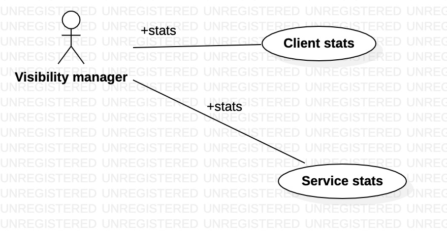
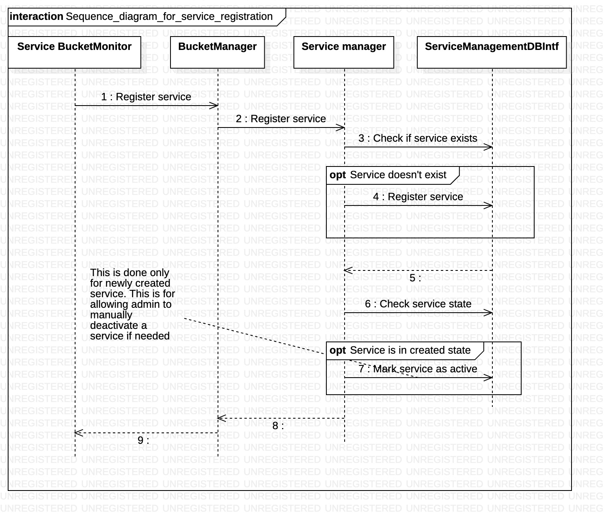

<!-- vscode-markdown-toc -->
* 1. [Vision](#Vision)
* 2. [Requirements break-down](#Requirementsbreak-down)
	* 2.1. [Functional requirements](#Functionalrequirements)
	* 2.2. [Non-functional requirements](#Non-functionalrequirements)
	* 2.3. [Non requirement](#Nonrequirement)
* 3. [Architecture](#Architecture)
	* 3.1. [Architecture diagram](#Architecturediagram)
	* 3.2. [Architecture principles](#Architectureprinciples)
* 4. [Use cases walkthrough](#Usecaseswalkthrough)
* 5. [Important scenerios](#Importantscenerios)
* 6. [Component design](#Componentdesign)
	* 6.1. [Client Management component](#ClientManagementcomponent)
	* 6.2. [Service management component](#Servicemanagementcomponent)
* 7. [Database design](#Databasedesign)
	* 7.1. [Basic view of database](#Basicviewofdatabase)
	* 7.2. [Full view of database](#Fullviewofdatabase)
	* 7.3. [Customization of service info](#Customizationofserviceinfo)
* 8. [Class Diagrams](#ClassDiagrams)
	* 8.1. [Class diagram for core classes](#Classdiagramforcoreclasses)
	* 8.2. [Class diagram for bucket manager (service owner specific)](#Classdiagramforbucketmanagerserviceownerspecific)
	* 8.3. [Class diagram for bucket manager (Client specific)](#ClassdiagramforbucketmanagerClientspecific)
	* 8.4. [Class diagram for DB Interfaces](#ClassdiagramforDBInterfaces)
* 9. [Sequence diagram](#Sequencediagram)
	* 9.1. [Sequence diagram for service registration](#Sequencediagramforserviceregistration)
	* 9.2. [Sequence diagram for Client registration](#SequencediagramforClientregistration)
	* 9.3. [Sequence diagram for bucket creation](#Sequencediagramforbucketcreation)
	* 9.4. [Sequence diagram for bucket assignment](#Sequencediagramforbucketassignment)
	* 9.5. [Sequence diagram for storing processed data from client](#Sequencediagramforstoringprocesseddatafromclient)
* 10. [Test cases](#Testcases)
* 11. [Implementation](#Implementation)
	* 11.1. [Database view](#Databaseview)
		* 11.1.1. [Database real view snapshot for Service](#DatabaserealviewsnapshotforService)
		* 11.1.2. [Database real view snapshot for Client](#DatabaserealviewsnapshotforClient)
		* 11.1.3. [Database real view snapshot for bucket](#Databaserealviewsnapshotforbucket)
* 12. [System Troubleshoot and Visibility](#SystemTroubleshootandVisibility)
* 13. [Bugs](#Bugs)

<!-- vscode-markdown-toc-config
	numbering=true
	autoSave=true
	/vscode-markdown-toc-config -->
<!-- /vscode-markdown-toc -->
# Multi service plugin concurrent subsystem

##  1. Vision
Multiple clients like to contribute in multiple services (example listed below)
1. DM Check service
2. Follower check service
3. Following check service
4. A new service
These clients can come and go anytime. System should provide fault tolerant and efficient solution for them to contribute.

##  2. Requirements break-down
###  2.1. Functional requirements
* Multiple clients should be able to register for one or more services [Done]
* A service may be added anytime [Done]
* System should facilitate for revoking of a service. 
* In case any service is revoked, past activity related to service must be preserved.
* A registered client can only work on a valid service
* System should be able to deactivate clients for services
[Pending]
* Client should able to check if a service is valid or not
* Multiple clients should be able to proxy using same Tweeter ID. However, in this case, its  the client responsibility to maintain harmony among themselves. System will treat all such clients as identical [Pending]
* Faulty client can submit incorrect info. System should allow to recover in such case. As an approach, system can log client activity [Pending]

###  2.2. Non-functional requirements
* System should able to add new services using plugin model.
* System should  deactivate inactive clients for services.
* Client needs to activate service in case it comes back again
* Client should not wait for registration of service [Done]
* System should be able to scale with reasonable limit. Limit should be advertised [Pending]
* System should be lock-free. Lock must be used only when it can't be avoided. Its requirement for scale. Lock will be bottleneck for any system with lock 
* System should facilitate enough data for monitoring and troubleshooting [Pending]
* System should be able to minimize impact of erroneous client. A repeated registratration request from same client should not affect other clients.
* System should keep enough stats for client access to service

###  2.3. Non requirement
* System doesn't support grouping of services

##  3. Architecture
Concurrent processing of each service can be mapped to public distribution system(PDS). Note that PDS shops gives the fix amount of groceriers to multiple card holders. Card holder can be anyone who has government approval. Generally on distribution day, there will be queue. To speedize, this shop owner makes bucket of rations as pre-processing. This helps shop owner to distribute ration in parallel.

###  3.1. Architecture diagram

###  3.2. Architecture principles
1. Lock free concurrency (for scale)
2. Linear span- optimal number of variables (for stability, maintanenence)
3. No duplication of data
4. Simple in design and simple in implementation

##  4. Use cases walkthrough

##  5. Important scenerios

##  6. Component design
###  6.1. Client Management component

###  6.2. Service management component

##  7. Database design
###  7.1. Basic view of database

###  7.2. Full view of database

###  7.3. Customization of service info

##  8. Class Diagrams
###  8.1. Class diagram for core classes

###  8.2. Class diagram for bucket manager (service owner specific)

###  8.3. Class diagram for bucket manager (Client specific)

###  8.4. Class diagram for DB Interfaces

##  9. Sequence diagram
###  9.1. Sequence diagram for service registration

###  9.2. Sequence diagram for Client registration

###  9.3. Sequence diagram for bucket creation

###  9.4. Sequence diagram for bucket assignment

###  9.5. Sequence diagram for storing processed data from client

##  10. Test cases

##  11. Implementation

###  11.1. Database view
####  11.1.1. Database real view snapshot for Service

####  11.1.2. Database real view snapshot for Client

####  11.1.3. Database real view snapshot for bucket

##  12. System Troubleshoot and Visibility 

##  13. Bugs
